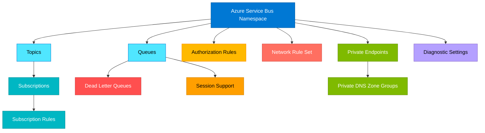

# terraform-azure-service-bus

Production-ready Terraform module for deploying Azure Service Bus with comprehensive support for queues, topics, subscriptions, authorization rules, network security, private endpoints, and diagnostics.

## Architecture



## Features

- Service Bus Namespace with Basic, Standard, and Premium SKU support
- Queues with dead-letter support, session handling, duplicate detection, and message TTL
- Topics with subscriptions and SQL/Correlation filter rules
- Namespace, queue, and topic-level authorization rules
- Network rule sets with IP rules and VNet integration
- Private endpoint connectivity with DNS zone groups
- Managed identity support (SystemAssigned, UserAssigned)
- Customer-managed key encryption
- Diagnostic settings for Log Analytics, Storage, and Event Hub
- Zone redundancy for Premium namespaces

## Usage

```hcl
module "service_bus" {
  source = "path/to/terraform-azure-service-bus"

  name                = "sb-myapp-prod"
  resource_group_name = "rg-myapp"
  location            = "East US"
  sku                 = "Premium"
  capacity            = 1

  queues = {
    "orders" = {
      max_delivery_count                   = 10
      dead_lettering_on_message_expiration = true
      default_message_ttl                  = "P14D"
    }
  }

  topics = {
    "events" = {
      max_size_in_megabytes = 5120
    }
  }

  subscriptions = {
    "events-processor" = {
      topic_name         = "events"
      max_delivery_count = 10
    }
  }

  tags = {
    Environment = "production"
  }
}
```

## Examples

- [Basic](./examples/basic/) - Simple namespace with queues
- [Advanced](./examples/advanced/) - Topics, subscriptions, rules, and authorization
- [Complete](./examples/complete/) - Full production setup with Premium SKU, private endpoints, network rules, and diagnostics

## Requirements

| Name | Version |
|------|---------|
| terraform | >= 1.3.0 |
| azurerm | >= 3.80.0 |

## Inputs

| Name | Description | Type | Default | Required |
|------|-------------|------|---------|----------|
| name | The name of the Service Bus namespace | `string` | n/a | yes |
| resource_group_name | The resource group name | `string` | n/a | yes |
| location | The Azure region | `string` | n/a | yes |
| sku | The SKU (Basic, Standard, Premium) | `string` | `"Standard"` | no |
| capacity | Messaging units for Premium | `number` | `0` | no |
| queues | Map of queues to create | `map(object)` | `{}` | no |
| topics | Map of topics to create | `map(object)` | `{}` | no |
| subscriptions | Map of subscriptions to create | `map(object)` | `{}` | no |
| subscription_rules | Map of subscription rules | `map(object)` | `{}` | no |
| namespace_authorization_rules | Namespace auth rules | `map(object)` | `{}` | no |
| queue_authorization_rules | Queue auth rules | `map(object)` | `{}` | no |
| topic_authorization_rules | Topic auth rules | `map(object)` | `{}` | no |
| network_rule_set | Network rule set config | `object` | `null` | no |
| private_endpoints | Private endpoints to create | `map(object)` | `{}` | no |
| diagnostic_settings | Diagnostic settings | `map(object)` | `{}` | no |
| tags | Tags to assign | `map(string)` | `{}` | no |

## Outputs

| Name | Description |
|------|-------------|
| namespace_id | The ID of the Service Bus namespace |
| namespace_name | The name of the Service Bus namespace |
| namespace_endpoint | The endpoint URL |
| default_primary_connection_string | Primary connection string (sensitive) |
| queue_ids | Map of queue names to IDs |
| topic_ids | Map of topic names to IDs |
| subscription_ids | Map of subscription names to IDs |
| private_endpoint_ids | Map of private endpoint names to IDs |
| private_endpoint_ip_addresses | Map of private endpoint IPs |

## License

MIT License - see [LICENSE](./LICENSE) for details.
